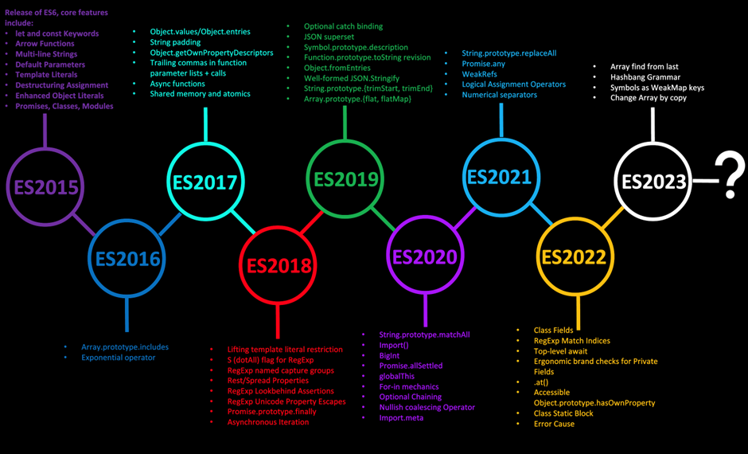

# tsconfig.json 해부하기
- tsconfig.json은 `tsc --init` 명령어를 실행하면 생성되는 TypeScript의 설정 파일이다. 주로 프로젝트의 컴파일 옵션 및 입력 파일, 출력 경로 및 다양한 옵션 등을 정의하는 데 사용된다.

## 생성된 tsconfig.json 파일
- tsconfig.json을 생성하게 되면, compilerOptions라는 프로퍼티 안에 여러가지의 속성들이 있다.
```
{
  "compilerOptions": {
    /* Visit https://aka.ms/tsconfig to read more about this file */

    /* Projects */
    // "incremental": true,                              /* Save .tsbuildinfo files to allow for incremental compilation of projects. */
    // "composite": true,                                /* Enable constraints that allow a TypeScript project to be used with project references. */
    // "tsBuildInfoFile": "./.tsbuildinfo",              /* Specify the path to .tsbuildinfo incremental compilation file. */
    // "disableSourceOfProjectReferenceRedirect": true,  /* Disable preferring source files instead of declaration files when referencing composite projects. */
    // "disableSolutionSearching": true,                 /* Opt a project out of multi-project reference checking when editing. */
    // "disableReferencedProjectLoad": true,             /* Reduce the number of projects loaded automatically by TypeScript. */

    /* Language and Environment */
    "target": "es2016",                                  /* Set the JavaScript language version for emitted JavaScript and include compatible library declarations. */
    // "lib": [],                                        /* Specify a set of bundled library declaration files that describe the target runtime environment. */
    // "jsx": "preserve",                                /* Specify what JSX code is generated. */
    // "experimentalDecorators": true,                   /* Enable experimental support for legacy experimental decorators. */
    // "emitDecoratorMetadata": true,                    /* Emit design-type metadata for decorated declarations in source files. */
    // "jsxFactory": "",                                 /* Specify the JSX factory function used when targeting React JSX emit, e.g. 'React.createElement' or 'h'. */
    // "jsxFragmentFactory": "",                         /* Specify the JSX Fragment reference used for fragments when targeting React JSX emit e.g. 'React.Fragment' or 'Fragment'. */
    // "jsxImportSource": "",                            /* Specify module specifier used to import the JSX factory functions when using 'jsx: react-jsx*'. */
    // "reactNamespace": "",                             /* Specify the object invoked for 'createElement'. This only applies when targeting 'react' JSX emit. */
    // "noLib": true,                                    /* Disable including any library files, including the default lib.d.ts. */
    // "useDefineForClassFields": true,                  /* Emit ECMAScript-standard-compliant class fields. */
    // "moduleDetection": "auto",                        /* Control what method is used to detect module-format JS files. */

    /* Modules */
    "module": "commonjs",                                /* Specify what module code is generated. */
    // "rootDir": "./",                                  /* Specify the root folder within your source files. */
    // "moduleResolution": "node10",                     /* Specify how TypeScript looks up a file from a given module specifier. */
    // "baseUrl": "./",                                  /* Specify the base directory to resolve non-relative module names. */
    // "paths": {},                                      /* Specify a set of entries that re-map imports to additional lookup locations. */
    // "rootDirs": [],                                   /* Allow multiple folders to be treated as one when resolving modules. */
    // "typeRoots": [],                                  /* Specify multiple folders that act like './node_modules/@types'. */
    // "types": [],                                      /* Specify type package names to be included without being referenced in a source file. */
    // "allowUmdGlobalAccess": true,                     /* Allow accessing UMD globals from modules. */
    // "moduleSuffixes": [],                             /* List of file name suffixes to search when resolving a module. */
    // "allowImportingTsExtensions": true,               /* Allow imports to include TypeScript file extensions. Requires '--moduleResolution bundler' and either '--noEmit' or '--emitDeclarationOnly' to be set. */
    // "resolvePackageJsonExports": true,                /* Use the package.json 'exports' field when resolving package imports. */
    // "resolvePackageJsonImports": true,                /* Use the package.json 'imports' field when resolving imports. */
    // "customConditions": [],                           /* Conditions to set in addition to the resolver-specific defaults when resolving imports. */
    // "resolveJsonModule": true,                        /* Enable importing .json files. */
    // "allowArbitraryExtensions": true,                 /* Enable importing files with any extension, provided a declaration file is present. */
    // "noResolve": true,                                /* Disallow 'import's, 'require's or '<reference>'s from expanding the number of files TypeScript should add to a project. */

    /* JavaScript Support */
    // "allowJs": true,                                  /* Allow JavaScript files to be a part of your program. Use the 'checkJS' option to get errors from these files. */
    // "checkJs": true,                                  /* Enable error reporting in type-checked JavaScript files. */
    // "maxNodeModuleJsDepth": 1,                        /* Specify the maximum folder depth used for checking JavaScript files from 'node_modules'. Only applicable with 'allowJs'. */

    /* Emit */
    // "declaration": true,                              /* Generate .d.ts files from TypeScript and JavaScript files in your project. */
    // "declarationMap": true,                           /* Create sourcemaps for d.ts files. */
    // "emitDeclarationOnly": true,                      /* Only output d.ts files and not JavaScript files. */
    // "sourceMap": true,                                /* Create source map files for emitted JavaScript files. */
    // "inlineSourceMap": true,                          /* Include sourcemap files inside the emitted JavaScript. */
    // "outFile": "./",                                  /* Specify a file that bundles all outputs into one JavaScript file. If 'declaration' is true, also designates a file that bundles all .d.ts output. */
    "outDir": "./dist/",                                   /* Specify an output folder for all emitted files. */
    // "removeComments": true,                           /* Disable emitting comments. */
    // "noEmit": true,                                   /* Disable emitting files from a compilation. */
    // "importHelpers": true,                            /* Allow importing helper functions from tslib once per project, instead of including them per-file. */
    // "importsNotUsedAsValues": "remove",               /* Specify emit/checking behavior for imports that are only used for types. */
    // "downlevelIteration": true,                       /* Emit more compliant, but verbose and less performant JavaScript for iteration. */
    // "sourceRoot": "",                                 /* Specify the root path for debuggers to find the reference source code. */
    // "mapRoot": "",                                    /* Specify the location where debugger should locate map files instead of generated locations. */
    // "inlineSources": true,                            /* Include source code in the sourcemaps inside the emitted JavaScript. */
    // "emitBOM": true,                                  /* Emit a UTF-8 Byte Order Mark (BOM) in the beginning of output files. */
    // "newLine": "crlf",                                /* Set the newline character for emitting files. */
    // "stripInternal": true,                            /* Disable emitting declarations that have '@internal' in their JSDoc comments. */
    // "noEmitHelpers": true,                            /* Disable generating custom helper functions like '__extends' in compiled output. */
    // "noEmitOnError": true,                            /* Disable emitting files if any type checking errors are reported. */
    // "preserveConstEnums": true,                       /* Disable erasing 'const enum' declarations in generated code. */
    // "declarationDir": "./",                           /* Specify the output directory for generated declaration files. */
    // "preserveValueImports": true,                     /* Preserve unused imported values in the JavaScript output that would otherwise be removed. */

    /* Interop Constraints */
    // "isolatedModules": true,                          /* Ensure that each file can be safely transpiled without relying on other imports. */
    // "verbatimModuleSyntax": true,                     /* Do not transform or elide any imports or exports not marked as type-only, ensuring they are written in the output file's format based on the 'module' setting. */
    // "allowSyntheticDefaultImports": true,             /* Allow 'import x from y' when a module doesn't have a default export. */
    "esModuleInterop": true,                             /* Emit additional JavaScript to ease support for importing CommonJS modules. This enables 'allowSyntheticDefaultImports' for type compatibility. */
    // "preserveSymlinks": true,                         /* Disable resolving symlinks to their realpath. This correlates to the same flag in node. */
    "forceConsistentCasingInFileNames": true,            /* Ensure that casing is correct in imports. */

    /* Type Checking */
    "strict": true,                                      /* Enable all strict type-checking options. */
    // "noImplicitAny": true,                            /* Enable error reporting for expressions and declarations with an implied 'any' type. */
    // "strictNullChecks": true,                         /* When type checking, take into account 'null' and 'undefined'. */
    // "strictFunctionTypes": true,                      /* When assigning functions, check to ensure parameters and the return values are subtype-compatible. */
    // "strictBindCallApply": true,                      /* Check that the arguments for 'bind', 'call', and 'apply' methods match the original function. */
    // "strictPropertyInitialization": true,             /* Check for class properties that are declared but not set in the constructor. */
    // "noImplicitThis": true,                           /* Enable error reporting when 'this' is given the type 'any'. */
    // "useUnknownInCatchVariables": true,               /* Default catch clause variables as 'unknown' instead of 'any'. */
    // "alwaysStrict": true,                             /* Ensure 'use strict' is always emitted. */
    // "noUnusedLocals": true,                           /* Enable error reporting when local variables aren't read. */
    // "noUnusedParameters": true,                       /* Raise an error when a function parameter isn't read. */
    // "exactOptionalPropertyTypes": true,               /* Interpret optional property types as written, rather than adding 'undefined'. */
    // "noImplicitReturns": true,                        /* Enable error reporting for codepaths that do not explicitly return in a function. */
    // "noFallthroughCasesInSwitch": true,               /* Enable error reporting for fallthrough cases in switch statements. */
    // "noUncheckedIndexedAccess": true,                 /* Add 'undefined' to a type when accessed using an index. */
    // "noImplicitOverride": true,                       /* Ensure overriding members in derived classes are marked with an override modifier. */
    // "noPropertyAccessFromIndexSignature": true,       /* Enforces using indexed accessors for keys declared using an indexed type. */
    // "allowUnusedLabels": true,                        /* Disable error reporting for unused labels. */
    // "allowUnreachableCode": true,                     /* Disable error reporting for unreachable code. */

    /* Completeness */
    // "skipDefaultLibCheck": true,                      /* Skip type checking .d.ts files that are included with TypeScript. */
    "skipLibCheck": true                                 /* Skip type checking all .d.ts files. */
  }
}

```

## tsconfig.json의 주요 옵션
- `compilerOptions - strict`: TypeScript의 `strict` 옵션은 꼭 기본적으로 true로 설정해 주어야 한다. 이는 타입 검사 옵션을 활성화하는 옵션이다. 이 옵션을 활성화 하면, 아래의 옵션들 또한 자동으로 활성화 된다.
    - `strictNullChecks`: 잠재적으로 null 혹은 undefined가 될 수 있는 값들을 검사하는 옵션이다.
    - `strictFunctionTypes`
    - `strictBindCallApply`
    - `strictPropertyInitialization`
    - `noImplicitAny`: 함수의 인자 또는 변수의 타입이 선언되지 않은 경우 컴파일러가 자동으로 `any`를 붙이지 않게 하는 옵션이다. 이 옵션을 활성화하여 누락된 타입 선언을 확인하고 명시적으로 타입을 선언하여야 한다.
    - `noImplicitThis`
    - `alwaysStrict`
- `compilerOptions - sourceMap`: 이는 컴파일된 JavaScript 파일에 대한 소스맵을 생성하는 옵션이다.
    - `소스맵(sourceMap)`은 컴파일된 .js 코드 실행 중 에러가 났을 때, 원래 TypeScript 소스 코드의 위치를 자동으로 매핑시켜 주어서 해당 `TypeScript 소스코드의 위치를 확인`할 수 있는 기능을 제공한다.
        - 이는 코드 디버깅에 매우 도움이 되기 때문에 개발 환경에서는 꼭 옵션을 지정해 주어야 한다.
    - 이에 따라, TypeScript의 `sourceMap` 옵션은 `개발 환경`에서 true로 설정해 주는 것이 좋다. 또한 `프로덕션 환경`에서는 용량이나 성능 상의 이유로 sourceMap을 false 로 설정해 주는 것이 좋다.
- `compilerOptions - target`: TypeScript 프로젝트 코드들을 어떤 버전의 JavaScript로 변환할지 지정하는 옵션이다.
    - es5: CommonJS 버전이다. 만약 프로젝트가 레거시한 환경에서 동작해야 한다면 es5를 지정해 준다.
    - `es2016`(es7): ES2016 버전이다. 최신 브라우저는 보통 ES2016을 지원하기 때문에 es2016을 지정해 주는 것이 좋다.
    - JavaScript 버전 타임라인:  
        - es6 이후로 가면서 sugar synthetic한(문법적으로 편한) 기능들이 많아졌다.
- `compilerOptions - module`: TypeScript 파일을 컴파일한 후 생성되는 JavaScript 모듈의 형식을 지정한다. 이는 모듈을 가져오고 내보내는 방식을 결정하는 옵션이다.
    - ex) import/export(es6) or require/module.exports(commonjs)
- `compilerOptions - outDir`: 이 옵션은 컴파일 완료된 JavaScript 파일이 저장될 출력 폴더를 지정할 수 있는 옵션이다. 
    - ex) `"outDir": "dist"`로 설정하면 컴파일된 .js 파일들이 root의 dist 폴더에 저장된다. 보통은 dist 혹은 bin 으로 설정한다.
- `include`, `exclude`: tsc 컴파일러가 컴파일을 시도할 때, 포함하거나 제외할 디렉토리를 지정할 수 있는 옵션이다.
    - `"include": ["src/**/*"]`: src 폴더와 그 내부 항목들을 모두 컴파일 하겠다는 의미이다.
    - `"exclude": ["node_modules", "dist"]`: node_modules 폴더와 dist 폴더 항목들은 모두 컴파일 대상에서 제외하겠다는 의미이다.
- 그 외의 tsconfig.json 옵션 `공식 메뉴얼`: https://www.typescriptlang.org/ko/tsconfig

